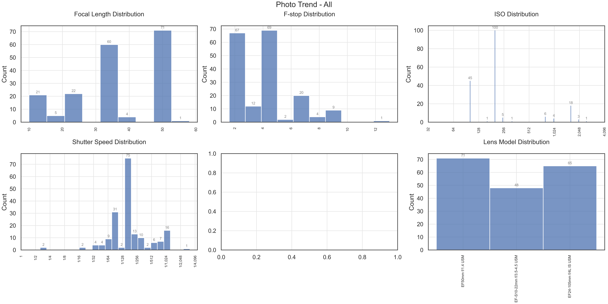

# Discover Your Photography Trends and Statistics


This is a simple script to collect statistics of your photographs and plots charts that showcase the trends and data.

Tested with:

- JPEGs
- Canon RAW
- Fujifilm RAW
- Nikon RAW
- Sony RAW

Tested on (via GitHub Actions):

- Windows
- Ubuntu
- macOS

## How to Install

1. Create a Anaconda environment (replace `py38` below with any name that you like)

   ```shell
   $ conda create -y -n py38 python=3.8
   ```

2. Install dependencies

   ```shell
   $ conda activate py38
   $ conda env update -f environment.yml
   ```

3. Test your installation

   ```shell
   $ cd src
   $ python analyse_images.py -d test_data
   ```

## How to Use

1. Run the script
2. The charts will be saved in the `src/plots` folder (in the parent folder of the script / beside the script)

- Basic usage: Analyse all RAW images

  ```shell
  $ cd src
  $ python analyse_images.py -d <directory_to_analyse>
  ```

- If the number of images is large (10k or above), you can run it in memory saving mode, which will disable some charts

  ```shell
  $ cd src
  $ python analyse_images.py -m -d <directory_to_analyse>
  ```

- Advanced usage: Analyse all JPEG images

  ```shell
  $ cd src
  $ python analyse_images.py -j -d <directory_to_analyse>   # Analyse all JPEGs
  $ python analyse_images.py -j -oo -d <directory_to_analyse>   # Analyse all unprocessed JPEGs
  $ python analyse_images.py -j -po -d <directory_to_analyse>   # Analyse all processed JPEGs
  $ python analyse_images.py -j -po -m -d <directory_to_analyse>   # Analyse all processed JPEGs, memory saving
  ```

## Example Charts

- 
